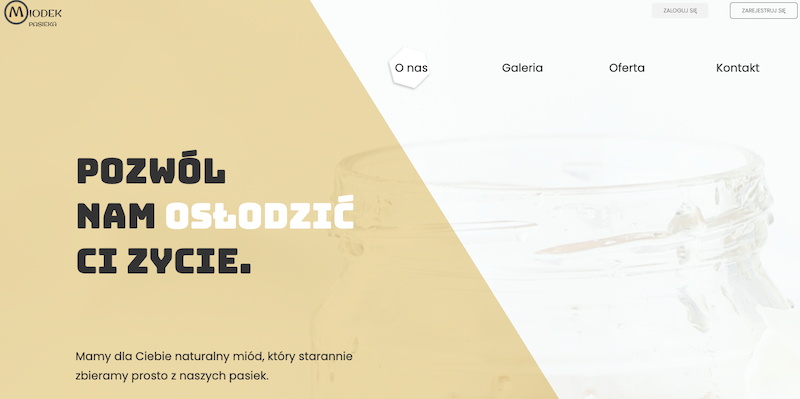
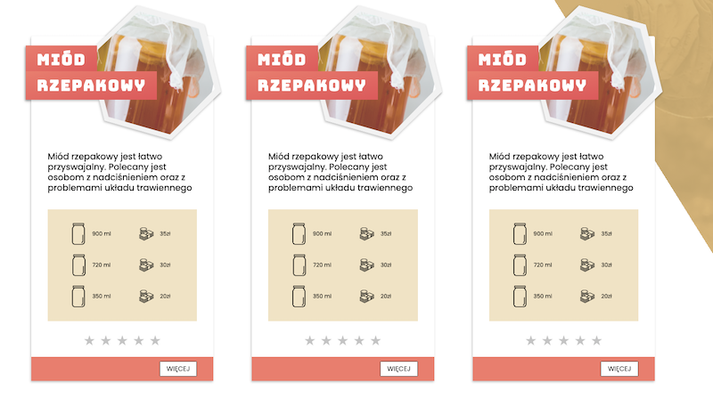
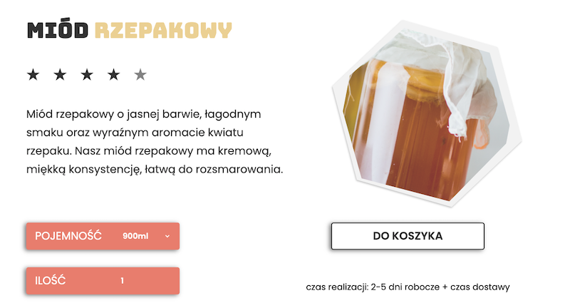
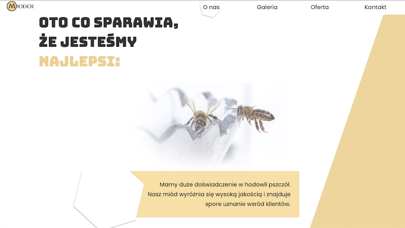

# Miodek v3

**Miodek v3** is my biggest website - containing 14 pages. Write for a real company with honey for sale. Including lazy loading images and slider components. Fully responsive with an easy to manage SCSS structure.

just visit [gregsypek.github.io/wordsApp](http://gregsypek.github.io/honey)!

### Features

- responsiwe web design
- lazy loading images
- includes the Intersection Observer API
- slider components
- tabbed components
- animations
- no external libraries
- etc.

#### Under the hood

Technologies being used under the hood:

- Node
- Vanillia JS
- Sass

#### Future plans

- add database with MongoDB
- change the website from static into dynamic.
- add backend with express
- add administration panel

### License

MIT

---

Made with [@gregsypek](https://twitter.com/@gregsypek) 2021
